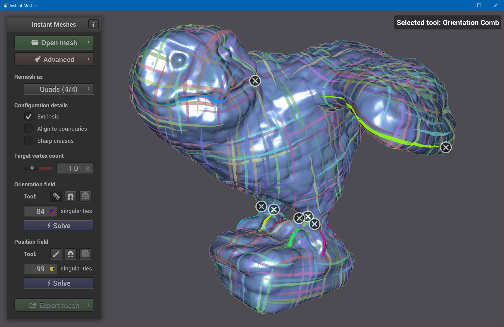
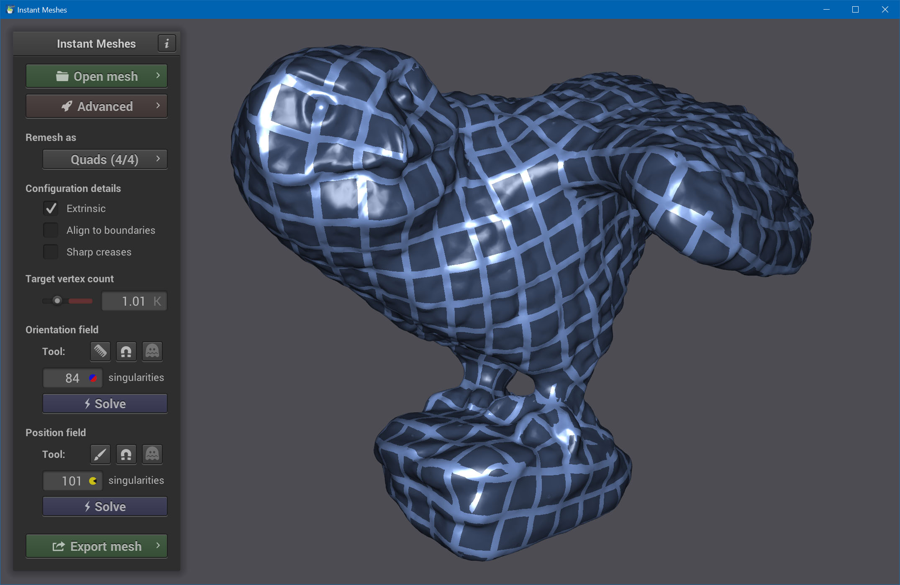
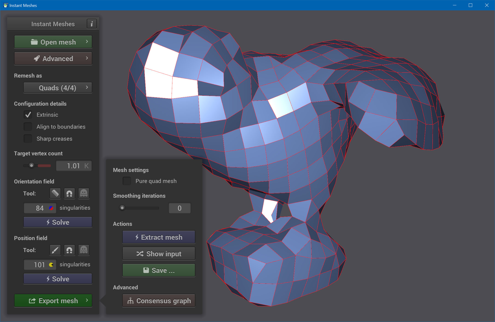
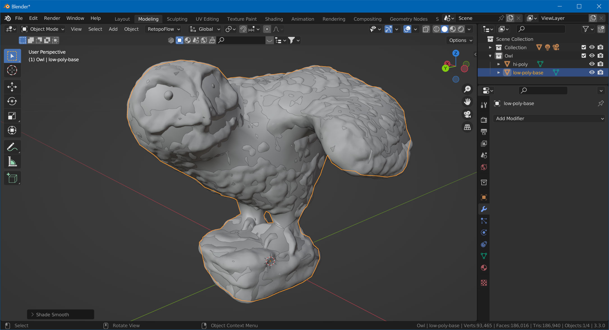
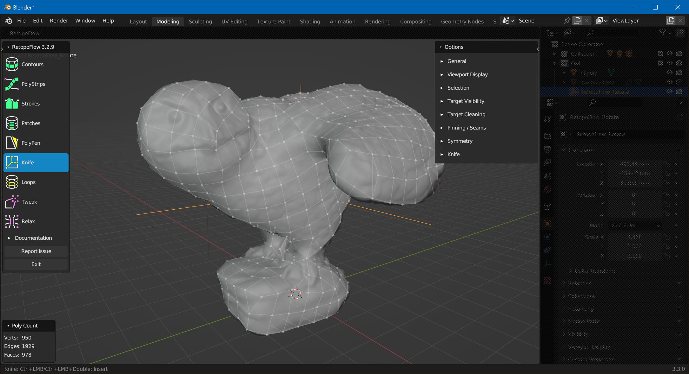
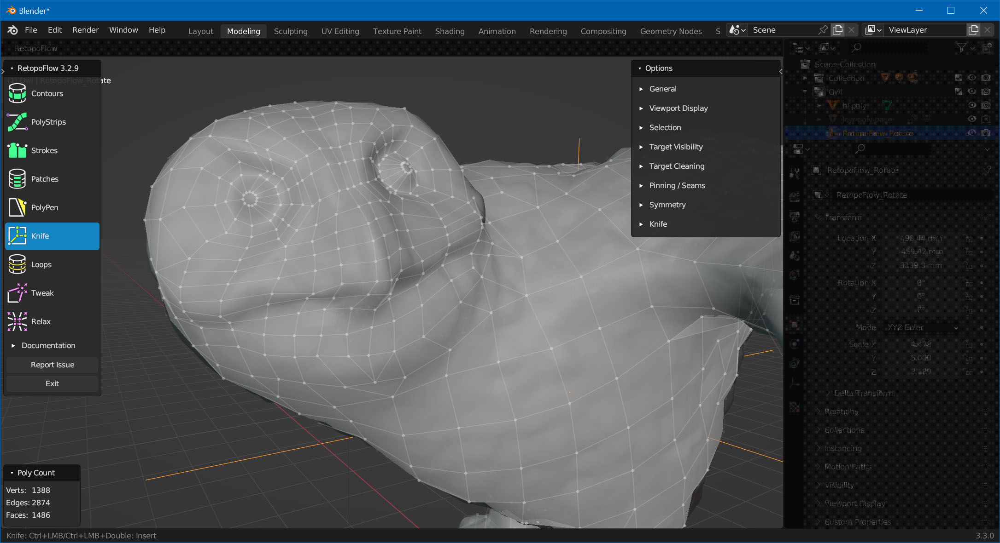

# Mesh Retopology

For this step we'll need two additional tools:

- [Instant Meshes](https://github.com/wjakob/instant-meshes) (a standalone tool)
- [RetopoFlow 3](https://github.com/CGCookie/retopoflow) (a Blender plug-in)

Both programs are free and open source.

## Retopowhat?

From [blender.org](https://docs.blender.org/manual/en/latest/modeling/meshes/retopology.html):

> Retopology is the process of simplifying the topology of a mesh to make it cleaner and easier to work with. Retopology is need for mangled topology resulting from sculpting or generated topology, for example from a 3D scan. 

You're probably not going to rig and animate your playfield toy. However, retopology gives you the possibility to put in more geometry where it's most visible, adding more details to your mesh for the same price (=poly count).

Our approach here is to let *Instant Meshes* handle most of the heavy work, and manually add more details where appropriate.

## Base Topology

Open up *Instant Meshes* and load `hi-poly.obj`. Now you need to decide the number of vertices you're aiming for. Since we're going to add more geometry later, we can aim pretty low. In our case, we're going for a thousand vertices.

Set *Target vertex count* to 1K, then click on *Solve* under *Orientation field*. This gives you hints how the geometry will be oriented.

Now, if you're doing this the first time, you probably have no idea what to look for. In general, what you're aiming for is an orientation field that is well aligned with the geometry. For example, we would like to have an orientation along each of the crawls, so we can more easily add details without having to move too much vertices around.

Use the *comb* tool to draw new lines. Each time you add a new line, the program updates the orientation field to accommodate for the new orientation you're setting. 

In our example, we've added new orientations to the crawls, the wings and the face. We didn't go into too much detail for the face, since we're re-doing that one manually later anyway.

Now, click on *Solve* under *Position field*. This gives you a rough idea how the polygons will be aligned. If necessary, re-comb and solve again.

Click on *Export Mesh* and *Extract Mesh*. This shows you the mesh we're going fine-tune in Blender.

Click on *Save* and export it as `low-poly-base.obj`.

## Fine-Tune

Go back to Blender, and import `low-poly-base.obj`. Select it, and choose *Object -> Shade Smooth*.

If you haven't yet, install the [RetopoFlow 3](https://github.com/CGCookie/retopoflow) plugin. We won't go into too much detail on how to use RetopoFlow, but this tutorial should teach you the basics:

> [!Video https://www.youtube.com/embed/X8kQiccJetw]

In order to get your imported model into RetopoFlow, select the mesh, enter edit mode, click on the *RetopoFlow* button, and select *Start RetopoFlow*.

Now, re-topo the parts that need more details. In our example, we've completely removed and remodeled the head, added more geometry to the feet and some to the wings. We've also aligned some vertices to better match the model.

> [!note]
> #### Quads vs Tris
> You're probably heard about the debate whether to use purely quads or triangles in your geometry. [Here](http://wedesignvirtual.com/quads-vs-tris-in-3d-modeling/) is a pretty good overview about the pros and cons of each.
>
> In short, since we're not purists and are working on game assets, some triangles are fine.

So you got your mesh. Spend some time fine-tuning it. Rotate, and check if there are any important angles that look too blocky. Add more geometry if needed, but also keep in mind the distance from which your toy will be typically rendered (probably no one will zoom-in fully on your model during game play).

Now let's [bring back the details of the original geometry](xref:tutorial_3d_scan_3).
